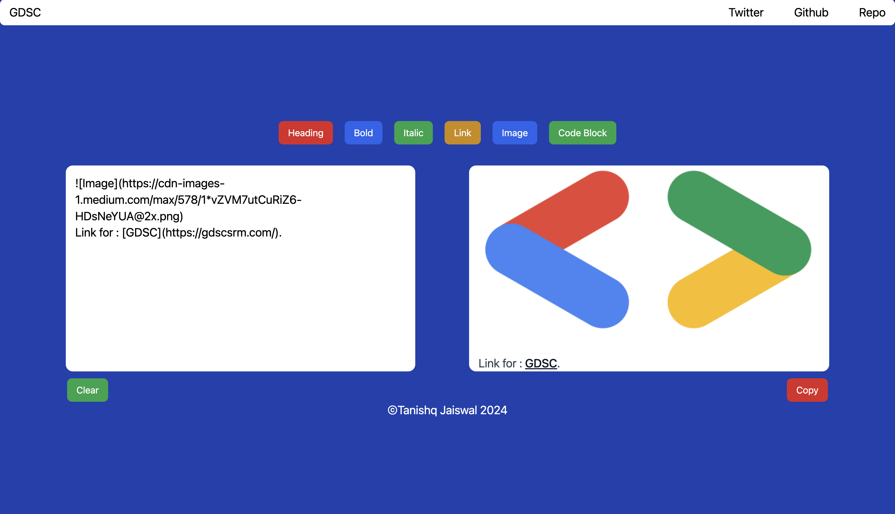
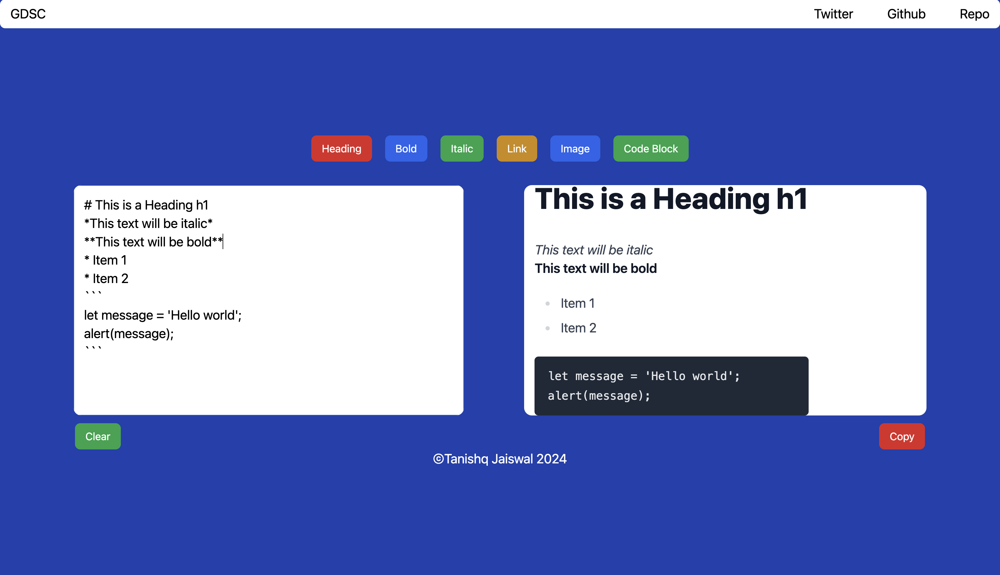
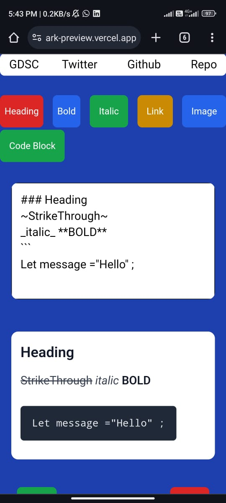

<h1 align="center" id="title">QuickMark Preview</h1>

<p id="description">MarkDown Previewer is a user-friendly web application designed to assist users in writing and previewing Markdown content in real-time. Leveraging the power of remark-gfm, the application seamlessly converts Markdown text into HTML, providing users with an instant visual representation of their formatted content. Built with React and styled using Tailwind CSS, MarkDown Previewer offers a clean and intuitive interface, making it effortless for users to compose and visualize Markdown documents with syntax highlighting and a real-time preview pane.</p>

<h2>🚀 Live</h2>
[Live Link](https://quickmark-preview.vercel.app/)

  
  
<h2>🧐 Features</h2>

Here're some of the project's features:

*   Real-time Markdown Rendering.
*   Easy to use interface.
*   GitHub Flavoured Markdown Support.

<h2>📷 Screenshots:</h2>






<h2>🛠️ Installation Steps:</h2>

<p>1. Clone the Repository:</p>

```
git clone https://github.com/lohitkolluri/QuickMark-Preview
```

<p>2. Navigate to the Project Directory:</p>

```
cd QuickMark-Preview
```

<p>3. Install Dependencies:</p>

```
yarn
```

<p>4. Start the Development Server:</p>

```
yarn dev
```

  
  
<h2>💻 Built with</h2>

Technologies used in the project:

*   React
*   React Markdown
*   Remark-GFM
*   Tailwind CSS
